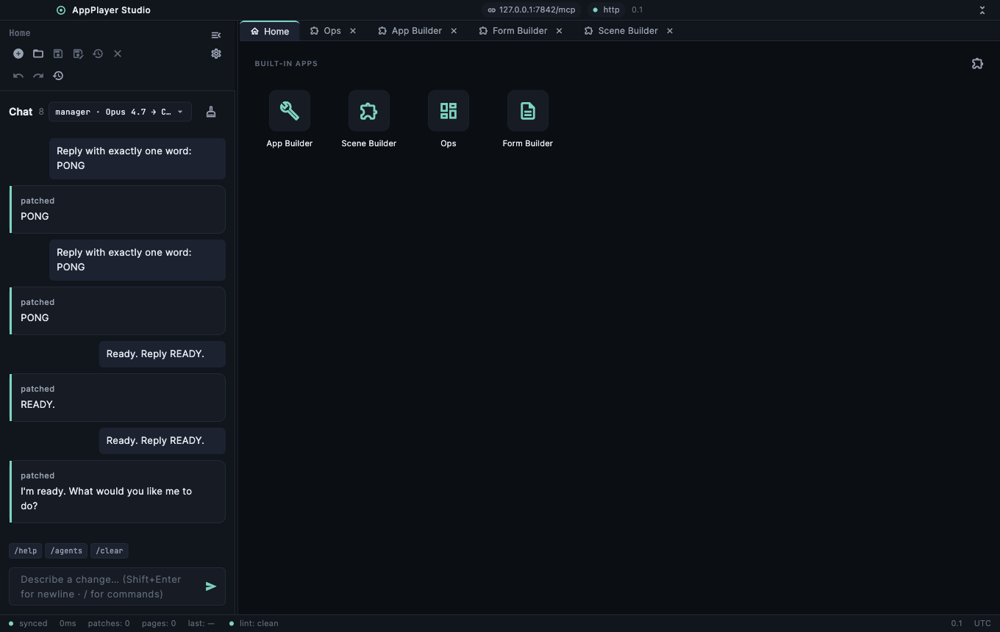
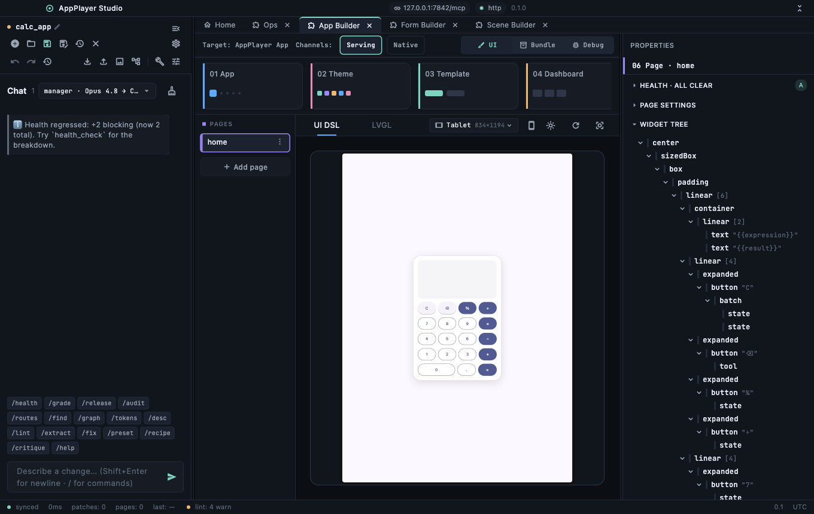
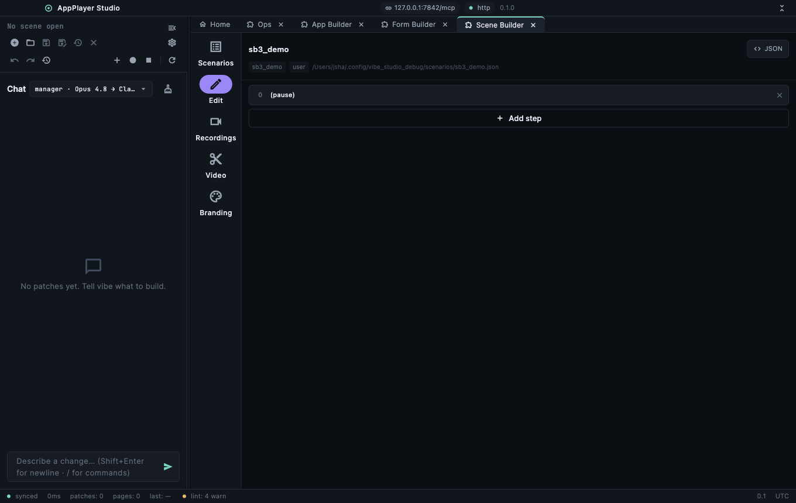

# AppPlayer Studio

A universal desktop host that loads any installed domain bundle (`.mcpb`) into
a workspace. The studio ships **zero domain code** — the shell composes a chrome
around a DSL-driven workspace, each bundle brings its own MCP endpoints and UI,
and the host supplies a shared surface of platform capabilities. It is a
universal launcher, an authoring environment, and an MCP server all at once.

Runs on **macOS, Windows, and Linux**.



## What it does

- **Loads domain bundles** — drop in a `.mcpb` bundle and the studio renders its
  UI (a declarative MCP-UI DSL) and wires its MCP tools, resources, and prompts.
  A bundle can be an installed package or a live MCP server served over the
  network — both mount as first-class workspace tabs.
- **Built-in apps** — four first-party surfaces ship in the box:
  - **App Builder** — compose a bundle's UI, tools, and manifest from a chat and
    atomic edits; preview across device sizes; build and debug the bundle as a
    `bundle` / `inline` / native executable and inspect its live MCP wire.

    

  - **Scene Builder** — record studio activity and produce annotated demo videos
    (overlays, narration, branding, web export).

    
  - **Ops** — operate an organization: workspaces, knowledge, agents, skills,
    profiles, philosophies, tasks, processes, an org chart, an inbox with
    approvals, and an audit log.
  - **Form Builder** — author paper-form templates, compose and validate
    submissions, issue immutable documents through an approval flow, and keep a
    document register.
- **Connects MCP servers & devices** — discover boards and services over
  mDNS / BLE / USB, connect any MCP server as a served-app tab, and onboard a
  nearby device onto Wi-Fi (`provision.*` — BLE, SoftAP, serial console, or
  SmartConfig) so it can serve MCP on the LAN.
- **Host capability surface** — the studio exposes platform capabilities
  (`fs.*`, `db.*`, `kv.*`, `canvas.*`, `analysis.*`, `browser.*`, `form.*`,
  `io.*`, `channel.*`, `provision.*`, board discovery) on a shared registry, so
  a bundle's `type:tool` calls reach them in-process — no bundle ships its own
  copy.
- **MCP-native** — the studio is itself an MCP server. Any MCP client can drive
  it and any active bundle through the standard tool / resource / prompt
  surface.

## Three ways to drive it

The same studio responds to three actors, all through the MCP surface:

1. **A person** at the GUI — clicking, typing, dragging.
2. **The built-in chat agent** — describe a change and the agent authors it with
   its own tools (runs on your Claude subscription via Claude Code, or an API
   key).
3. **An external MCP client** (e.g. Claude Desktop, an automation script) —
   connects to the studio's HTTP MCP endpoint and calls `studio.*` and the
   active bundle's tools directly.

## Getting started

```sh
flutter pub get
flutter run -d macos      # or -d windows / -d linux
```

This package resolves entirely from published dependencies, so a fresh clone
builds without any extra setup. Requires the Dart SDK `^3.7.0` (bundled with a
recent Flutter).

### Driving it over MCP

The studio serves a Streamable-HTTP MCP endpoint (default `127.0.0.1:7840`;
override with `--port`). Point any MCP client at `http://127.0.0.1:7840/mcp` to
introspect and call the `studio.*` tools (chrome, UI driving, screenshot,
project/bundle lifecycle) alongside whatever the active bundle exposes.

## Architecture

- **Zero domain code** — the shell knows nothing about any bundle's domain; a
  bundle is manifest + UI DSL + MCP endpoints. Removing a bundle removes its
  feature cleanly.
- **DSL-driven workspace** — bundle UIs render through `flutter_mcp_ui_runtime`;
  the host owns only the chrome (tab strip, project chrome, chat panel).
- **Shared capability registry** — host-owned capability tools are injected once
  and reused by every bundle in-process (the parity rule), so a served bundle
  behaves the same in the studio as it does on AppPlayer.

## Built on

AppPlayer Studio composes the published ecosystem packages — `brain_kernel`
(the MCP-native kernel), `flutter_mcp_ui_runtime` / `flutter_mcp_ui_core` (the
DSL renderer), `mcp_client` / `mcp_server` (MCP transports), `appplayer_ui_view`,
`appplayer_secure`, `appplayer_claude_code_provider`, `mcp_browser`,
`mcp_bundle`, and more — all resolved from pub.dev.

## License

MIT — see [LICENSE](LICENSE).
